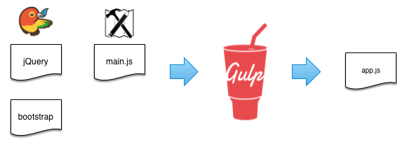

Example Usage
=============

asset-builder works great with [gulp][]. But it can be used in pretty much any application where you need to combine a bunch of asset globs.

## Simple Usage With gulp



### Regular

```js
gulp.src([
  'bower_components/jquery/jquery.js',
  'bower_components/bootstrap/component.js',
  'assets/scripts/main.js'
])
  .pipe(concat('app.js')
  .pipe(minify())
  .pipe(gulp.dest('dist'));
```

### asset-builder

#### `assets/manifest.json`

```json
{
  "dependencies": {
    "app.js": {
      "files": ["scripts/main.js"],
      "main": true
    },
  },
  "paths": {
    "source": "assets/",
    "dist": "dist/"
  }
}
```

#### `gulpfile.js`

```js
var manifest = require('asset-builder')('./assets/manifest.json');

var app = manifest.getDependencyByName('app.js');

gulp.src(app.globs)
  .pipe(concat(app.name)
  .pipe(minify())
  .pipe(gulp.dest(manifest.paths.dist));
```

### Benefits

- **Reuse your gulpfile, change the manifest.** Using asset-builder all the project specific configuration is done in the manifest JSON file. That way you can reuse gulpfiles across common projects or project modules.
- **Build configuration externalized.** Change your build directory structure in one place.
- **Use bower.json to control bower packages.** Do not manually manage your dependency graph

[gulp]: http://gulpjs.com/
