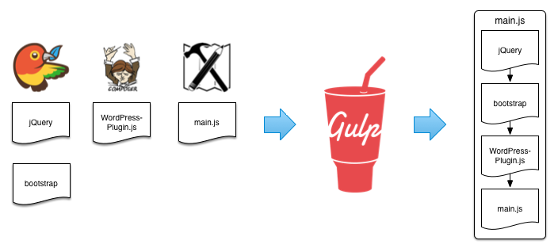

Example Usage
=============

asset-builder works great with [gulp][]. But it can be used in pretty much any application where you need to combine a bunch of asset globs.

## Simple Usage With gulp


### Regular

```js
gulp.src([
  'bower_components/jquery/jquery.js',
  'bower_components/bootstrap/component.js',
  'assets/scripts/main.js'
])
  .pipe(concat('app.js'))
  .pipe(minify())
  .pipe(gulp.dest('dist'));
```

### asset-builder

#### `assets/manifest.json`

```json
{
  "dependencies": {
    "app.js": {
      "files": ["scripts/main.js"],
      "main": true
    },
  },
  "paths": {
    "source": "assets/",
    "dist": "dist/"
  }
}
```

#### `gulpfile.js`

```js
var manifest = require('asset-builder')('./assets/manifest.json');

var app = manifest.getDependencyByName('app.js');

gulp.src(app.globs)
  .pipe(concat(app.name))
  .pipe(minify())
  .pipe(gulp.dest(manifest.paths.dist));
```

### Benefits

- **Reuse your gulpfile, change the manifest.** Using asset-builder all the project specific configuration is done in the manifest JSON file. That way you can reuse gulpfiles across common projects or project modules.
- **Build configuration externalized.** Change your build directory structure in one place.
- **Use bower.json to control bower packages.** Do not manually manage your dependency graph

## Advanced Usage With gulp

Suppose you have a website with the following structure:

- 20 regular pages that use basic jQuery and bootstrap for things like tabs and menus.
- 1 "graphing" page where d3 and nvd3 is used to build some really nice graphs and charts.

The 20 regular pages have nothing to do with graphing. So on those pages d3 and nvd3 are unused dependencies. You run some benchmarks and you conclude that by excluding d3 and nvd3 from your 20 regular pages, you will net a significant performance increase.


### Regular

```js
gulp.task('js:main', function () {
  return gulp.src([
    'bower_components/jquery/jquery.js',
    'bower_components/bootstrap/component.js',
    'assets/scripts/main.js'
  ])
    .pipe(concat('app.js'))
    .pipe(minify())
    .pipe(gulp.dest('dist'));
});


gulp.task('js:graph', function () {
  return gulp.src([
    'bower_components/d3/d3.js',
    'bower_components/nvd3/nvd3.js',
    'assets/scripts/graphs.js'
  ])
    .pipe(concat('graph-page.js'))
    .pipe(minify())
    .pipe(gulp.dest('dist'));
});

gulp.task('js', ['js:main', 'js:graph']);
// eww
```

### asset-builder

```json
{
  "dependencies": {
    "app.js": {
      "files": ["scripts/main.js"],
      "main": true
    },
    "graph-page.js": {
      "files": ["scripts/graphs.js"],
      "bower": ["d3", "nvd3"]
    }
  },
  "paths": {
    "source": "assets/",
    "dist": "dist/"
  }
}
```

```js
var manifest = require('asset-builder')('./assets/manifest.json');

gulp.task('js', function() {
  var merge = require('merge-stream');
  manifest.forEachDependency('js', function(dep) {
    merge.add(
      gulp.src(dep.globs, {base: 'scripts'})
        .pipe(concat(dep.name))
        .pipe(minify())
    );
  });
  return merge
    .pipe(gulp.dest('dist'));
});
```

### Benefits

- **Separate build input from build process** The declarative manifest format makes build output easier to discern.
- **All grouped asset types use the same pipeline.** Increases build consistency and maintainability.

## Pull Vendor Assets from External Folder (WordPress Plugin, Composer)



### Regular

```js
gulp.src([
  'bower_components/jquery/jquery.js',
  'bower_components/bootstrap/component.js',
  '../../plugins/WordPress-plugin/scripts/plugin.js',
  'assets/scripts/main.js'
])
  .pipe(concat('app.js'))
  .pipe(minify())
  .pipe(gulp.dest('dist'));
```

### asset-builder

#### `assets/manifest.json`

```json
{
  "dependencies": {
    "app.js": {
      "vendor": [
        "../../plugins/WordPress-plugin/scripts/plugin.js"
      ],
      "files": ["scripts/main.js"],
      "main": true
    },
  },
  "paths": {
    "source": "assets/",
    "dist": "dist/"
  }
}
```

#### `gulpfile.js`

```js
var manifest = require('asset-builder')('./assets/manifest.json');

var app = manifest.getDependencyByName('app.js');

gulp.src(app.globs)
  .pipe(concat(app.name))
  .pipe(minify())
  .pipe(gulp.dest(manifest.paths.dist));
```

### The Vendor Property

The vendor property is a part of the [dependency serialization][dependency]. Why
would you use the `vendor` property instead of the `files` property? What kind
of file paths would you put inside `vendor` but not inside `files`?

A path inside the `files` property such as `scripts/main.js` will be transformed
to `assets/scripts/main.js` if your manifest's `paths.source` is `assets/` and
the dependency's `external` property is not set to `true`. The `vendor` property
paths are relative to your project root. If you are using gulp, this is
typically where your gulpfile.js is located.

It follows that you would want to put all your first-party project scripts
inside the `files` property. Feel free to run your linters, styleguide checkers,
beautifiers, and more on these files.

The `vendor` property is for third-party code you have no control over. You
should not run project-specific linters, styleguide checkers, beautifiers, etc.
on these files.


#### Example

This assumes your `path.source` is `assets/`. Assume a project structure such
as:

<pre><code>
.
├── gulpfile.js
├── assets/
│   └── scripts/
│       └── main.js
└── vendor/
    └── foundry/
        └── flexslider.min.js
</code></pre>

<table class="table">
  <thead>
    <tr>
      <th>Property</th>
      <th>Path Before</th>
      <th>Path After</th>
    </tr>
  </thead>
  <tbody>
    <tr>
      <td><code>files</code></td>
      <td><code>scripts/main.js</code></td>
      <td><code>assets/scripts/main.js</code></td>
    </tr>
    <tr>
      <td><code>vendor</code></td>
      <td><code>vendor/foundry/flexslider.min.js</code></td>
      <td><code>vendor/foundry/flexslider.min.js</code></td>
    </tr>
  </tbody>
</table>

[gulp]: http://gulpjs.com/
[dependency]: spec.md#serialization-dependency
[paths]: spec.md#serialization-paths
